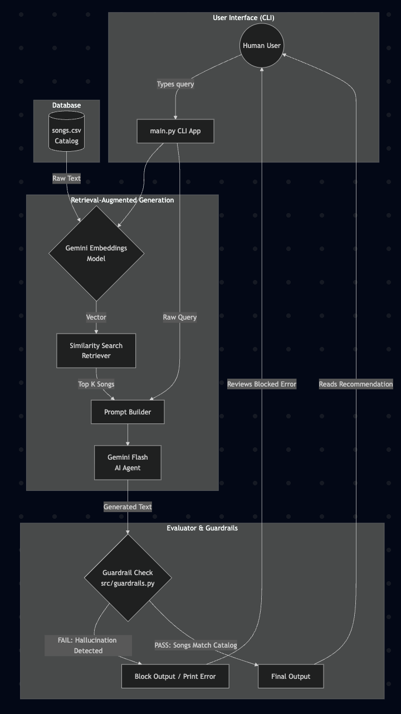

# 🎵 Applied AI System: Music Recommender with RAG

## Original Project Base
This project is an extension of my **Module 3: Music Recommender Simulation**.
The original system evaluated short, hardcoded user profiles (like "high-energy pop" or "chill lofi"). It scored each of the 20 songs in the catalog purely using mathematical rules (+2 points for a genre match, +1 point for a mood match). It successfully demonstrated how recommender catalogs score and prioritize items, but it was entirely rules-based and didn't understand conversational input.

## New Feature: Retrieval-Augmented Generation (RAG)
I have upgraded the system into an Applied AI System by introducing **Retrieval-Augmented Generation (RAG)** powered by the **Google Gemini API**.
Instead of using fixed dictionary profiles, users can enter detailed natural language requests (e.g., *"I'm looking for a fast-paced electronic track to pump me up for my workout"*).
The system:
1. Embeds the user's query and matches it against the embeddings of our 20-song catalog.
2. Retrieves the top-K matching songs.
3. Passes the results to Gemini (the AI Agent) so it can provide a conversational, tailored recommendation based strictly on the retrieved songs.

## Reliability & Guardrails Check
To ensure the AI is trustworthy, this project implements a **strict output Guardrail**. Because LLMs can hallucinate (e.g., confidently recommending a famous real-world song that doesn't actually exist in our small 20-song catalog), the guardrail script (`src/guardrails.py`) verifies the LLM's raw text response. It intercepts responses that do not contain the title of at least one retrieved song, blocking hallucinations entirely.

##  System Architecture
The flow from the terminal input, through the Gemini Embedding process, into Gemini Chat completion, via the Guardrails, and out to the User.




## ⚙️ Setup Instructions

Follow these step-by-step instructions to run the AI on your machine:

1. **Clone the repository and enter the directory**:
   ```bash
   git clone https://github.com/Pranillama/applied-ai-system.git
   cd applied-ai-system
   ```

2. **Create and activate a virtual environment**:
   ```bash
   python3 -m venv .venv
   source .venv/bin/activate
   ```

3. **Install dependencies**:
   ```bash
   pip install -r requirements.txt
   ```

4. **Set up your API Key**:
   - Rename the `.env.example` file to `.env`
   - Open `.env` and paste your Google Gemini API key inside it:
   ```
   GEMINI_API_KEY=your_actual_key_here
   ```

5. **Run the AI System**:
   ```bash
   python -m src.main
   ```

## Sample Interactions

**Example 1: Mood Match**
- **User Query**: *"I'm driving through the desert at night and need something intense."*
- **Retrieval**: Finds 'Storm Runner' and 'Neon Lights'
- **AI Output**: *"For a late-night desert drive, you need something driving and intense! I recommend **Storm Runner** by The Outliers. It's a rock track with incredibly high energy..."*

**Example 2: Guardrail Blocking**
- **User Query**: *"Who is the lead singer of Coldplay?"*
- **Guardrail**: *[BLOCKED BY GUARDRAIL] Guardrail Failed: The AI did not recommend any of our actual catalog songs! It may have hallucinated or ignored the context.*

## 🎥 Walkthrough Demo
*(Paste your Loom walkthrough video link here)*
